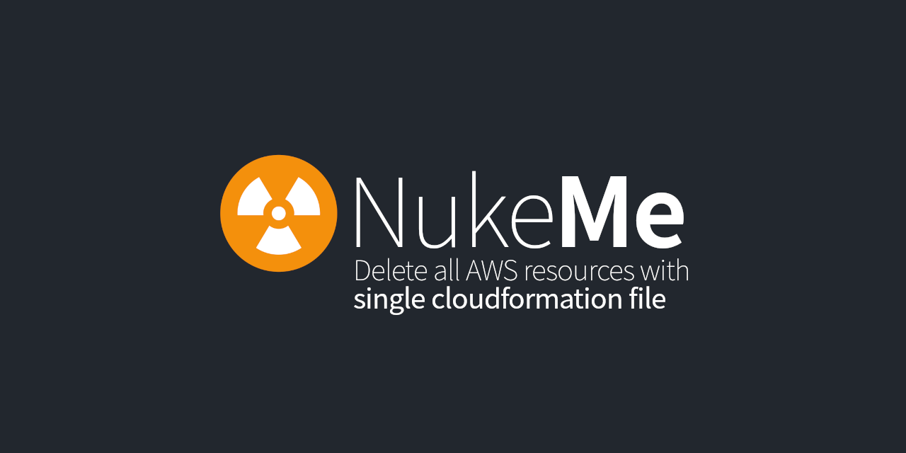
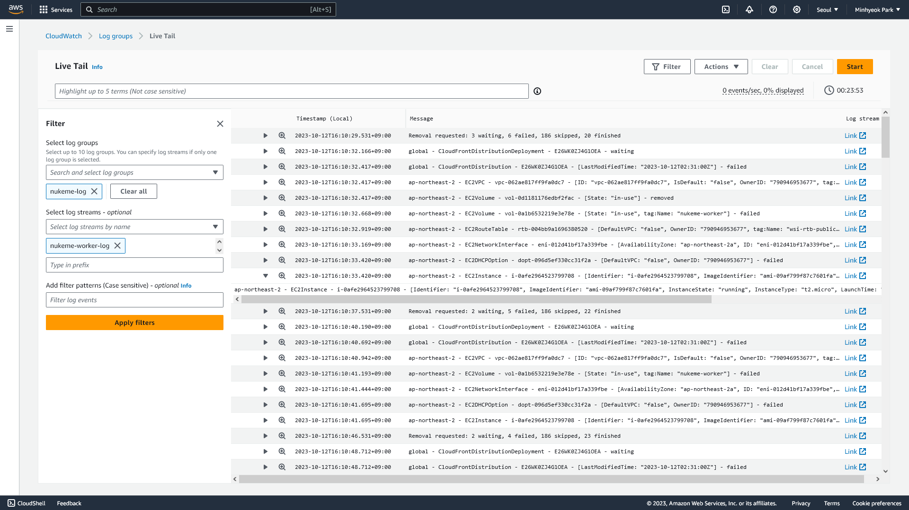

# ☢️ nukeme



**A single CloudFormation file** that deletes all resources in the running AWS account.

It uses [`aws-nuke` by rebuy-de](https://github.com/rebuy-de/aws-nuke) binary for nuking your account.

## how to run
> [!WARNING]
> Currently, `nukeme` doesn't support custom `aws-nuke` configuration. So  please run it only for "Sandbox Cleaning" purposes.

> [!IMPORTANT]
> DO NOT delete CloudFormation stack manually. it will automatically destroy itself when finished.

Just [**Click here**](https://console.aws.amazon.com/cloudformation/home#/stacks/create/review?templateURL=https://nukeme.s3.amazonaws.com/run&stackName=NukeMe)
to deploy CloudFormation stack.

or [**Create stack manually**](https://console.aws.amazon.com/cloudformation/home#/stacks/create) with following S3 URL:
```
https://nukeme.s3.amazonaws.com/run
```

and just drink your coffee! :coffee: or [monitor it](#logging)

## how it works
This stack contains following steps:
1. Create a IAM role that has AdministrarorAccess
2. Create VPC & Network components
3. Create single Worker Instance for `aws-nuke`
4. Configure Cloudwatch Agent for logging
5. Download and run `aws-nuke` binary.
6. Delete CloudFromation stack itself.

## logging


This stack automatically creates `aws-nuke` log for monitoring/debugging.

* Log group name: `nukeme-log`
* Log stream name: `nukeme-worker-log`
* [Try Live Tail service](https://console.aws.amazon.com/cloudwatch/home#logsV2:live-tail)


## `aws-nuke` configurations
This stack generates following `aws-nuke` configuration:
```yml
regions:
  - global
  - ${AWS::Region}

account-blocklist:
- "999999999999"

accounts:
  "${AWS::AccountId}":
    filters:
      CloudFormationStack:
        - "${AWS::StackName}"
      EC2VPC:
        - property: tag:Name
          value: nukeme-vpc
      EC2InternetGateway:
        - property: tag:Name
          value: nukeme-igw
      EC2InternetGatewayAttachment:
        - property: tag:igw:Name
          value: nukeme-igw
      EC2RouteTable:
        - property: tag:Name
          value: nukeme-rtb-public
      EC2Subnet:
        - property: tag:Name
          value: nukeme-subnet-public-a
      EC2SecurityGroup:
        - property: tag:Name
          value: nukeme-sg-worker
      IAMRole:
        - "nukeme-role-worker"
      IAMRolePolicy:
        - "nukeme-role-worker -> nukeme-policy-admin"
      IAMInstanceProfile:
        - "nukeme-role-worker"
      IAMInstanceProfileRole:
        - "nukeme-role-worker -> nukeme-role-worker"
      CloudWatchLogsLogGroup:
        - "nukeme-log"
      EC2Instance:
        - property: tag:Name
          value: nukeme-worker
      EC2Volume:
        - property: tag:Name
          value "nukeme-worker"
```
